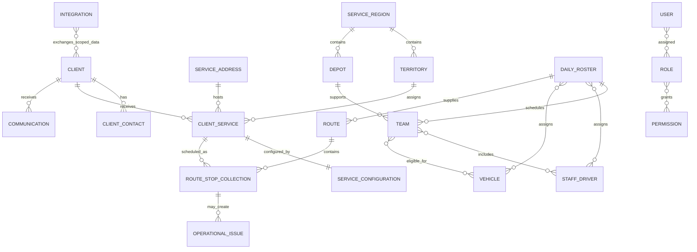

# High-Level Domain Model

**Status:** Approved conceptual model; not a database schema

## Modelling principles

- Every authoritative entity uses an immutable internal identifier.
- Mutable address text, email addresses, mobile numbers, public references, vehicle registrations, and provider identifiers are never primary keys.
- Client, service, and physical address are separate concepts.
- Several clients or services may exist at the same physical address.
- A client may have several contacts, services, and service addresses.
- A dedicated billing `Account` entity is deferred until its semantics are approved.
- External and legacy identifiers map to internal IDs and do not replace them.

## Conceptual relationships

The diagram is conceptual: it does not prescribe table names, cardinality implementation, or join-table design.

## Core concepts

| Concept | Meaning and boundary |
|---|---|
| Client | Person or organisation receiving or contracting for an operational service |
| Client Contact | A person or communication endpoint associated with a client |
| Client Service | The service relationship linking a client to a physical service address |
| Service Address | A reusable physical location with structured address and geographic coordinates |
| Service Configuration | Operational settings for a client service, including cadence, drum configuration, access information, and assignment rules |
| Service Region | Top-level operating geography |
| Territory | Operational subdivision/polygon within a region, including priority and eligibility rules |
| Depot | Operational start/end location associated with a region |
| Team | Operational collection unit eligible for work and vehicle assignments |
| Staff/Driver | Operational person; linked to a system user only when login access is required |
| Vehicle | Vehicle master record, capacity configuration, availability, and tracking-device relationship |
| Operational Day | Immutable region/date operating aggregate with lifecycle and lock state |
| Daily Roster Entry | Versioned day-specific team, staff, vehicle, and depot facts derived from permanent defaults |
| Daily Roster | Date-specific, historically preserved assignment of teams, staff/drivers, and vehicles |
| Route | Versioned daily plan assigned using roster and master-data facts |
| Route Stop / Collection | Scheduled service instance and eventual immutable collection outcome facts |
| Operational Issue | Actionable operational exception linked to relevant entities without taking ownership of them |
| Communication | Message intent, policy/template reference, and delivery attempts; provider metadata remains external evidence |
| Integration | Registered adapter, permitted scope, health, sync state, and conflicts |
| User / Role / Permission | Authenticated identity mapping and application-controlled authorization model |

## Historical integrity

Operational history must retain the route version, team, staff/driver, vehicle, configured and actual drum counts, timestamps, and outcome facts required to interpret past service. History references immutable IDs and may snapshot selected labels needed for durable interpretation; it must not depend on mutable address or assignment text.
# Phase 1A implemented master-data model

Phase 1A implements immutable UUID identities for `Client`, `ClientContact`, `ServiceAddress`, `ClientService`, `ServiceConfiguration`, `ServiceRegion`, `Depot`, `Territory`, `Team`, `Staff`, and `Vehicle`. Client, service, and physical address remain separate. A service joins one client to one address; neither relationship is unique, so a client can have several services and an address can serve several clients.

`ServiceConfiguration` is effective-dated and owned by the client service. It carries permanent region, depot, team, collection-day, territory/override, and configured drum-unit values. Daily exceptions remain outside this model. Address text and provider references are mutable attributes, never identity. Scoped `ExternalReference` rows map provider identifiers to internal IDs without becoming foreign master keys.

Geography uses PostGIS SRID 4326 geography points for service addresses and depots, and multipolygon geometry for territories. Territory overlap is resolved by explicit priority. Geometry edits do not mutate service assignments; Phase 1C Geography-owned review records identify materially affected services. Confirming a review crosses the Service Configuration application boundary to create a new effective-dated assignment. A permanent override wins over normal spatial suggestion and does not expire automatically. Service Regions remain logical containers without invented polygons.

Daily Roster sits between permanent master data and future Routes. Operational Day has an immutable UUID and is unique by service region/date. Entries snapshot expected defaults and preserve actual day-specific assignments plus append-only change history. Availability windows remain owned by Workforce and Vehicles; roster generation consumes them without changing master records.

Client and service lifecycle states are independent. Archival is a timestamped lifecycle transition and does not cascade-delete services or historical configuration. No billing Account entity exists.

Phase 4C preserves that decision. An external accounting customer maps to a Client through reconciliation and an external reference. Immutable provider facts derive a Client Accounting Snapshot and Operational Account Status; neither becomes a Client/Service lifecycle field, and the advisory financial eligibility projection makes no hold or route decision.
