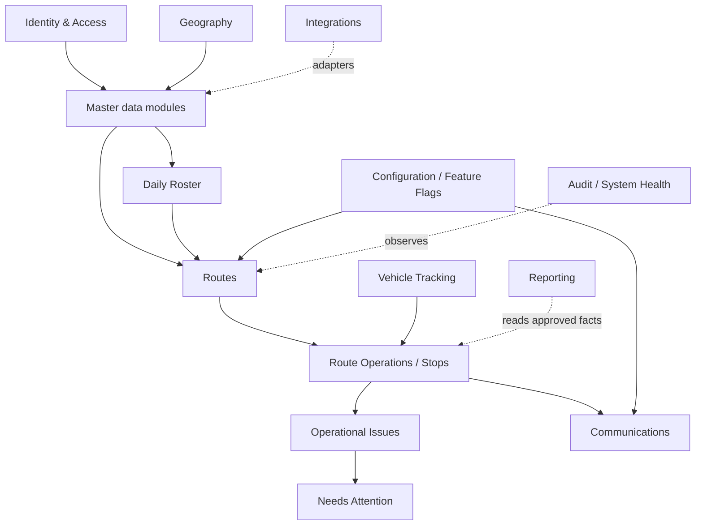

# Module Dependency Map

**Status:** Approved initial modular-monolith boundaries

## Boundary rules

- Each authoritative entity has one owning module.
- Other modules may read approved master data through stable query interfaces/read models.
- Only the owner may change its authoritative entity.
- Cross-module writes use the owner's application service or a versioned domain event; direct table updates are prohibited.
- Circular dependencies are prohibited. Where two modules need each other's facts, use an application orchestrator, stable read interface, or event-driven projection.
- These are internal modules in one deployable domain system, not microservices.

## Dependency direction

The diagram shows primary direction, not every permitted read.

## Ownership and collaboration

| Module | Owns | Approved reads by other modules | Modification path | Likely events |
|---|---|---|---|---|
| Identity & Access | User profiles, roles, permissions, assignments, access scopes, registered devices | Actor identity and authorization facts | Identity application services only | `UserProvisioned`, `RoleAssigned`, `PermissionChanged`, `DeviceApproved`, `DeviceRevoked` |
| Clients | Client identity, client contacts, operational client lifecycle | Services, Communications, Reporting, Issues | Clients application services only | `ClientCreated`, `ClientActivated`, `ClientPlacedOnHold`, `ClientCancelled`, `ContactChanged` |
| Service Addresses | Structured physical locations, coordinates, geocoding status | Services, Geography, Routes, Tracking | Service Addresses application services | `ServiceAddressCreated`, `ServiceAddressChanged`, `AddressGeocoded`, `AddressReviewRequired` |
| Service Configuration | Client service and operational configuration, cadence/day, drum configuration, access information, assignments | Routes, Route Operations, Communications, Reporting | Service Configuration application services; approved discrepancy workflow | `ServiceConfigured`, `DrumCountChanged`, `ServiceSuspended`, `ServiceAssignmentChanged` |
| Geography: Regions / Territories / Depots | Regions, depots, territories, polygons, priority and operating defaults | Services, Workforce, Vehicles, Roster, Routes, Tracking | Geography application services | `RegionChanged`, `TerritoryChanged`, `DepotChanged`, `AssignmentReviewRequired` |
| Workforce: Teams / Drivers | Teams, staff/driver operational directory, permanent membership, availability-relevant facts | Vehicles, Roster, Routes, Reporting | Workforce application services | `TeamMembershipChanged`, `StaffUnavailable`, `StaffAvailabilityRestored` |
| Vehicles | Vehicle master, availability, capacity configuration, device assignment | Roster, Routes, Tracking, Reporting | Vehicles application services | `VehicleAvailable`, `VehicleUnavailable`, `VehicleAssigned`, `CapacityConfigChanged` |
| Daily Roster | Date-specific team/driver/vehicle assignments, overrides and lock history | Routes, Route Operations, Tracking, Reporting | Roster application services | `RosterGenerated`, `RosterChanged`, `RosterLocked`, `RosterUnlocked` |
| Routes | Route plan, versions, sequence, assignment, publication and re-optimization | Route Operations, Tracking, Communications, Reporting | Routes application services and replaceable optimizer through them | `RouteGenerated`, `RoutePublished`, `RouteReoptimised`, `RouteAssignmentChanged` |
| Route Operations / Stops | Arrival/progress state, stop outcome, serviced quantity, dump actions, immutable service facts, route closure | Issues, Needs Attention, Communications, Reporting | Route Operations application services from authorized online/offline actions | `StopArrived`, `StopCompleted`, `StopOutcomeRecorded`, `ServiceDiscrepancyDetected`, `RouteClosed` |
| Vehicle Tracking | Raw telemetry, current vehicle state, device health, interpreted geofence/movement facts | Route Operations, Routes, System Health, Reporting | Tracking ingestion/application services only | `VehicleLocationUpdated`, `TrackingOffline`, `GeofenceEntered`, `RouteDeviationDetected` |
| Operational Issues | Issue lifecycle, evidence relationships, assignment and resolution | Needs Attention, Clients, Reporting | Issues services; other modules request creation or emit facts | `OperationalIssueCreated`, `IssueAssigned`, `OperationalIssueResolved` |
| Needs Attention | Actionable work-item projection and assignment | Office UI, Reporting, System Health | Needs Attention services; sources do not edit projection rows directly | `AttentionItemCreated`, `AttentionItemAssigned`, `AttentionItemResolved` |
| Communications | Templates, policies, message intent, attempts and inbound-message facts | Clients, Routes, Reporting, System Health | Communications services and provider adapters | `MessageRequested`, `MessageSent`, `MessageFailed`, `InboundMessageReceived` |
| Integrations | Connector registry, permitted scope, sync/import state, conflicts, adapter health | System Health, Audit, office administration | Integrations services/adapters only | `IntegrationActivated`, `ImportCompleted`, `SyncConflictCreated`, `IntegrationDegraded` |
| Configuration / Feature Flags | Typed settings, versions, rollout rules and flags | All modules through typed read interfaces | Configuration services with audit | `ConfigurationChanged`, `FeatureFlagChanged` |
| Reporting | Report definitions, saved views, export jobs; never duplicate master truth | Approved read models from all operational modules | Reporting services modify reporting artifacts only | `ExportRequested`, `ExportCompleted`, `ExportExpired` |
| Audit | Append-only actor/action/target records | Authorized audit and diagnostics readers | Central audit writer only | Audit facts are normally terminal records |
| System Health / Diagnostics | Health status, job/integration diagnostics and diagnostic artifacts | Outbox, jobs, integrations, API errors, tracking health | Platform-owned health services | `HealthDegraded`, `JobFailed`, `DeadLetterCreated`, `HealthRestored` |

## Important projection boundaries

- Needs Attention is a work projection, not a second issue authority.
- Reporting owns report definitions and artifacts, not copied editable operational records.
- Vehicle current state is derived by Tracking; raw provider telemetry is not the route state.
- Configuration values do not replace domain-owned business entities.
- Integration sync state and provider delivery state are metadata, not client/service lifecycle state.

