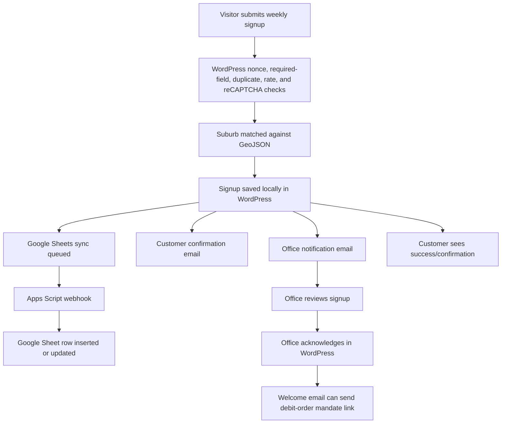
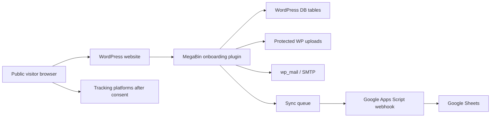

# MegaBin Website -> Control Centre Handover

> **Document status: legacy/source context.** This handover describes the separate WordPress website and informs migration planning. It is not authoritative Control Centre architecture.

## 1. Executive Summary

The current MegaBin project is a WordPress website, conceptually `megabin-website`. It handles public marketing pages, weekly collection signup capture, once-off collection quote request capture, service-area suburb checking, legal shortcodes, office/customer email notifications, local WordPress record storage, and Google Sheets sync.

The future MegaBin Control Centre must be a separate application/repository. It is expected to become the operational system for customer lifecycle, staff workflows, service operations, and Supabase-backed data ownership. The website should eventually communicate with it through a deliberate interface rather than owning core operational logic.

## 2. Current Website Architecture

```text
megabin-website
├── wp-content/themes/megabin/
│   ├── header/footer/templates
│   ├── responsive styling
│   ├── Elementor compatibility
│   └── SEO/schema output
├── wp-content/plugins/megabin-onboarding/
│   ├── public forms
│   ├── local WordPress tables
│   ├── service-area lookup
│   ├── settings/admin screens
│   ├── legal shortcodes
│   ├── email notifications
│   ├── Google Sheets sync queue
│   ├── reCAPTCHA/tracking
│   └── launch/readiness tools
├── scripts/google-apps-script/
│   └── Sheets webhook source
├── docs/
└── dist/
```

Current plugin version: `0.6.66`.

Current theme version: `0.4.48`.

## 3. Customer Onboarding Flow



Important behaviour:

- A submitted signup is not an active client.
- Starting signup status is `debit_order_pending`.
- Non-listed suburbs are not blocked; they are flagged for manual office review.
- Debit-order setup is not forced immediately after signup.

## 4. Current Data Flow



Local WordPress storage is currently the safest source of truth for website submissions. Google Sheets is a synced operational/export layer.

## 5. Existing Customer Data Structure

Main local tables created by `Installer.php`:

- `wp_megabin_signups`
- `wp_megabin_once_off_requests`
- `wp_megabin_sync_queue`

Key recurring signup groups:

- References and timestamps.
- Status and sync status.
- Customer type and identity details.
- Contact details.
- Service address and billing address.
- Service-area/manual-review result.
- Property/access/safety notes.
- Drum quantity and monthly pricing snapshot.
- Preferred debit-order day.
- Legal versions, acceptance timestamp, and signatory details.
- IP address, user agent, marketing consent, UTM/referrer.
- Agreement PDF/admin generation metadata.
- Office/customer/welcome email status metadata.

Key once-off request groups:

- Reference and timestamps.
- Request status and sync status.
- Contact details.
- Collection address.
- Load description and estimated loads.
- Advertised price snapshot.
- Preferred date and access notes.
- Terms/privacy/marketing consent.
- Protected photo metadata.
- Email status metadata.
- IP address, user agent, UTM/referrer.

See `MEGABIN_DATA_MODEL.md` for the detailed field list.

## 6. Existing Integrations

### Google Sheets / Apps Script

- WordPress queues payloads after local save.
- Queue posts to Apps Script webhook when enabled.
- Apps Script ensures tabs/headers and inserts or updates rows by reference.
- Repeated failures alert the office.
- This is a likely migration candidate once Control Centre exists.

### Email

- Office notifications go to configured office recipients.
- Customer confirmations are sent after successful local save.
- Welcome/debit-order emails are office-controlled after acknowledgement.
- Email uses `wp_mail`; production SMTP remains an operational dependency.

### reCAPTCHA

- Google reCAPTCHA v2 checkbox protects public forms when configured.
- Keys are stored in WordPress settings.

### Debit-Order Provider

- External mandate URL is stored in settings.
- It is sent after office review in a welcome email when configured.
- Banking details are not stored in WordPress.

### Tracking

- GA4, GTM, Meta Pixel, and TikTok Pixel IDs are stored in settings.
- Snippets and conversion events are consent-aware.

## 7. Existing Business Rules

Important rules for the Control Centre to preserve or centralise:

- Weekly price defaults to R195 per drum per month.
- Once-off advertised price defaults to R650 per full trailer load.
- Weekly drum quantity minimum is 1 and there is no online maximum.
- Billing dates are 15, 20, 25, and 30.
- Pro-rata is manually handled by the office; the website does not calculate a pro-rata amount.
- Recurring signup status starts as `debit_order_pending`.
- Once-off status starts as `quote_pending`.
- Unsupported/non-listed suburbs continue through signup but are flagged for manual review.
- Weekly debit-order setup occurs after office review, not immediately after public signup.
- Once-off payment is EFT after invoice.
- Marketing consent is optional and unticked by default.
- Public forms require nonce validation and use duplicate/rate protections.
- reCAPTCHA is enforced only when configured.
- Google Sheets sync must never block the customer if local save succeeded.

See `MEGABIN_BUSINESS_RULES.md` for implementation references.

## 8. Website Responsibilities

These should continue to live in WordPress/the public website unless intentionally changed:

- Public marketing pages.
- SEO metadata and public content.
- Header/footer/menu.
- Public weekly and once-off forms.
- Service-area checker UI.
- Customer-facing legal pages.
- Contact links and social links.
- Tracking pixels and website conversion events.
- Public confirmation/success states.
- Basic launch/readiness checks related to the website.

## 9. Future Control Centre Responsibilities

The future Control Centre should likely own:

- Staff login and permissions.
- Customer/account records.
- Operational customer lifecycle.
- Office review queues.
- Service activation.
- Route/day assignment.
- Drum inventory and recovery.
- Debit-order status tracking.
- Once-off quote, invoice, payment, and scheduling workflow.
- Internal reporting and dashboards.
- Supabase PostgreSQL schema, RLS policies, Auth, Storage, and other backend services.

Do not implement these in the website repository.

## 10. Future Integration Boundary

Likely boundary:

```text
megabin-website
  Public forms and marketing UI
  Minimal local fallback/audit if retained
  Calls controlled API

megabin-control-centre
  API boundary
  Supabase-backed business records
  Staff workflows
  Operational state
```

Potential future interfaces:

- Submit recurring signup.
- Submit once-off request with photos.
- Check service area.
- Fetch public reference data such as prices or approved suburbs.
- Send conversion-safe acknowledgement back to the website.

No final API is designed yet.

## 11. Migration Considerations

Google Sheets:

- Currently useful for launch visibility.
- Likely to be replaced by Control Centre workflows or retained as an export.

WordPress local records:

- Currently important because they preserve submissions even when Sheets/email fail.
- Future migration must decide whether to import historical submissions.

Protected uploads:

- Once-off photos and agreement PDFs are currently WordPress-upload based.
- Future Control Centre may prefer Supabase Storage or another controlled storage layer.

Settings:

- Prices, contact details, service-area path, legal versions, reCAPTCHA, tracking, Sheets, and debit-order URL live in WordPress settings.
- Future centralisation must avoid divergent values between website and Control Centre.

Legacy pages:

- `sign-up` can still exist as a page/redirect target, but primary CTAs should point to the Weekly Collection form anchor.
- Service Areas page exists but is intentionally not in the primary menu.

## 12. Risks / Technical Debt

- Sensitive customer identifiers are stored in WordPress. Future Control Centre must use strong database access controls and data-minimisation practices.
- A debit-order URL default exists in plugin settings source. Treat this as configuration and avoid copying exact values into docs.
- A Google spreadsheet identifier exists in settings/source defaults and Apps Script source. Treat it as operational config and avoid spreading it further.
- `.git` did not behave like a normal repository from the current folder during inspection; confirm source-control state before renaming.
- Google Sheets auth is a shared-secret webhook, not a full OAuth/service-account API.
- Google Sheets contains operational placeholders that may drift from future Control Centre schema.
- Email reliability depends on WordPress/hosting SMTP configuration.
- Host-level cache can still break forms if not excluded before WordPress loads.
- Launch page refresh tools can overwrite seeded page copy.
- Service-area logic is suburb-name based at launch; geometry/polygons are not the full runtime decision engine.
- Control Centre should not copy website-specific UI/image/settings complexity into its own domain model.

## 13. Open Questions

- Will the website continue saving locally after the Control Centre API exists?
- What is the canonical future customer/account identifier?
- Should existing WordPress submissions be migrated to Supabase?
- Will Google Sheets remain as an export after Control Centre launch?
- How will website-to-Control-Centre authentication work?
- How will duplicate submissions be detected across WordPress and Control Centre?
- Where will once-off photos and legal PDFs live long term?
- Will the Control Centre manage service areas and publish them to the website?
- Will debit-order provider data be integrated automatically or updated manually by staff?
- Which current website statuses should become canonical operational statuses?

## 14. Source Reference

Primary docs:

- `docs/PROJECT_CONTEXT.md`
- `docs/MEGABIN_SITE_HANDOVER.md`
- `docs/READ_THIS_BEFORE_MAKING_CHANGES.md`

Theme:

- `wp-content/themes/megabin/style.css`
- `wp-content/themes/megabin/header.php`
- `wp-content/themes/megabin/footer.php`
- `wp-content/themes/megabin/inc/schema.php`
- `wp-content/themes/megabin/assets/js/site.js`
- `wp-content/themes/megabin/assets/js/homepage.js`

Plugin bootstrap/settings:

- `wp-content/plugins/megabin-onboarding/megabin-onboarding.php`
- `wp-content/plugins/megabin-onboarding/includes/Plugin.php`
- `wp-content/plugins/megabin-onboarding/includes/Settings.php`
- `wp-content/plugins/megabin-onboarding/includes/Admin.php`
- `wp-content/plugins/megabin-onboarding/includes/Installer.php`

Forms and storage:

- `wp-content/plugins/megabin-onboarding/includes/Signup_Form.php`
- `wp-content/plugins/megabin-onboarding/includes/Once_Off_Form.php`
- `wp-content/plugins/megabin-onboarding/includes/Submission_Repository.php`
- `wp-content/plugins/megabin-onboarding/includes/Once_Off_Repository.php`
- `wp-content/plugins/megabin-onboarding/includes/Protected_Storage.php`
- `wp-content/plugins/megabin-onboarding/includes/Form_Guard.php`
- `wp-content/plugins/megabin-onboarding/includes/Recaptcha.php`

Service area:

- `wp-content/plugins/megabin-onboarding/includes/Geofence.php`
- `wp-content/plugins/megabin-onboarding/data/service-areas/megabin-pretoria-radius-geofence.geojson`

Legal and notifications:

- `wp-content/plugins/megabin-onboarding/includes/Legal_Documents.php`
- `wp-content/plugins/megabin-onboarding/includes/Agreement_Pdf.php`
- `wp-content/plugins/megabin-onboarding/includes/Notifications.php`
- `wp-content/plugins/megabin-onboarding/data/legal/LAUNCH_LEGAL_V1.md`

Integrations:

- `wp-content/plugins/megabin-onboarding/includes/Sheet_Sync.php`
- `wp-content/plugins/megabin-onboarding/includes/Sync_Queue_Repository.php`
- `wp-content/plugins/megabin-onboarding/includes/Tracking.php`
- `wp-content/plugins/megabin-onboarding/includes/Attribution.php`
- `scripts/google-apps-script/megabin-onboarding-webhook.gs`

Launch tools:

- `wp-content/plugins/megabin-onboarding/includes/Launch_Pages.php`
- `wp-content/plugins/megabin-onboarding/includes/Launch_Redirects.php`
- `wp-content/plugins/megabin-onboarding/includes/Launch_Readiness.php`
- `wp-content/plugins/megabin-onboarding/includes/Launch_Snapshot.php`
- `wp-content/plugins/megabin-onboarding/includes/Cache_Control.php`
